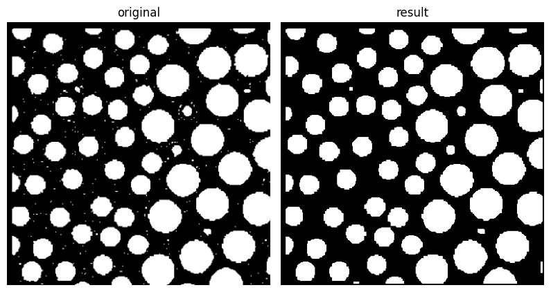
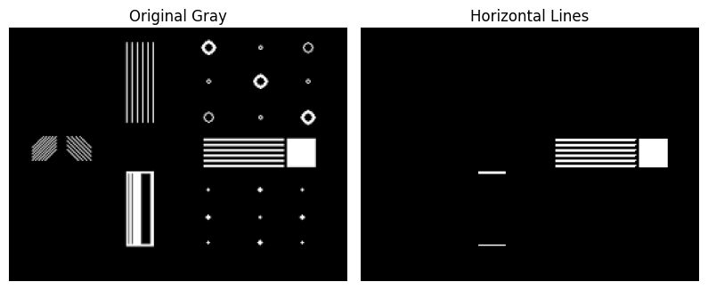
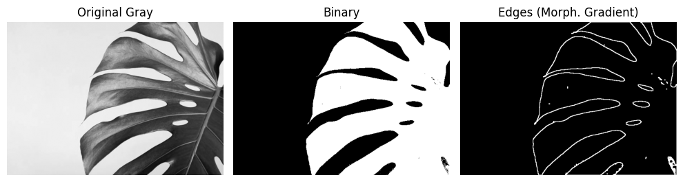
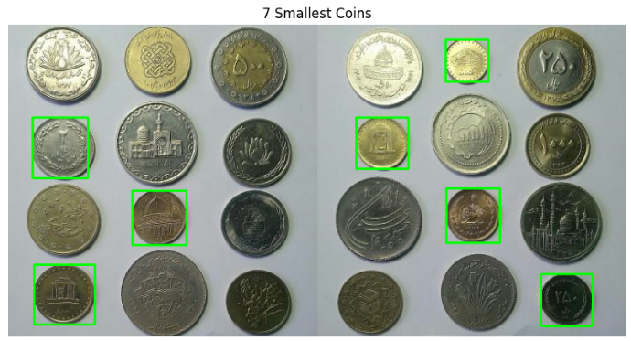
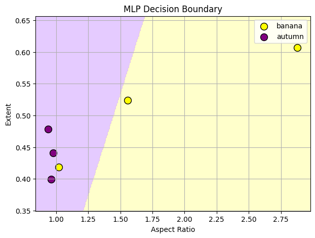

The project focuses on **morphological operations**, **connected component analysis**, and **shape-based feature extraction** in grayscale and binary images using Python and OpenCV.

---

## Question 1 — Morphological Operations  

This part explores the effect of basic morphological operators — **erosion**, **dilation**, **opening**, and **closing** — on binary and grayscale images for denoising and structure extraction.

---

### (a) Noise Removal  
Noise was removed using **morphological opening and closing**, combining **erosion** and **dilation**.  
These operations remove small noise particles while preserving the overall shape of objects.  

**Result:**  

---

### (b) Vertical Line Isolation  
A **vertical structuring element** was applied to isolate vertical lines while removing all other components in the image.  
This is useful for analyzing grid or document layouts.  

**Result:**  

---

### (c) Horizontal Line Isolation  
Similarly, a **horizontal structuring element** was used to retain only horizontal lines in the image.  

**Result:**  

---

### (d) Edge Detection on Leaf Image  
Edges were detected through the **morphological gradient**, computed as the difference between **dilated** and **eroded** images.  
This method emphasizes **boundaries and veins of the leaf** while suppressing uniform regions, providing a clean contour representation.  

**Result:**  

---

## Question 2 — Connected Components (Coin Detection)

The goal of this section was to **detect and count small coins** in an image using **connected component analysis**.  
Morphological preprocessing and labeling were used to isolate individual coins and measure their geometric features.

**Result:**  

---

##  Question 3 — Leaf Shape Feature Extraction and Classification  

In this part, images of **leaves from two distinct classes** were analyzed to extract **shape-based features**.  
Each leaf image was represented by a **feature vector** consisting of geometric descriptors such as:  
- Area  
- Perimeter  
- Circularity
- Aspect Ratio  

To validate feature extraction, for each leaf image, a **contour** was obtained and visualized using:  
- **Minimum Enclosing Circle**, or  
- **Bounding Rectangle**

Then, two of the extracted features were selected to create a **2D scatter plot**, visualizing class separability for **six leaf samples**.  
Each data point represents one leaf image, labeled by its class.

A **linear separability analysis** was then conducted to evaluate whether these features could distinguish the two classes using a **simple linear classifier**.  
This step provides insight into the **discriminative power** of geometric shape descriptors.

**Result Example:**  
*(Feature-space visualization of two leaf classes)*  

